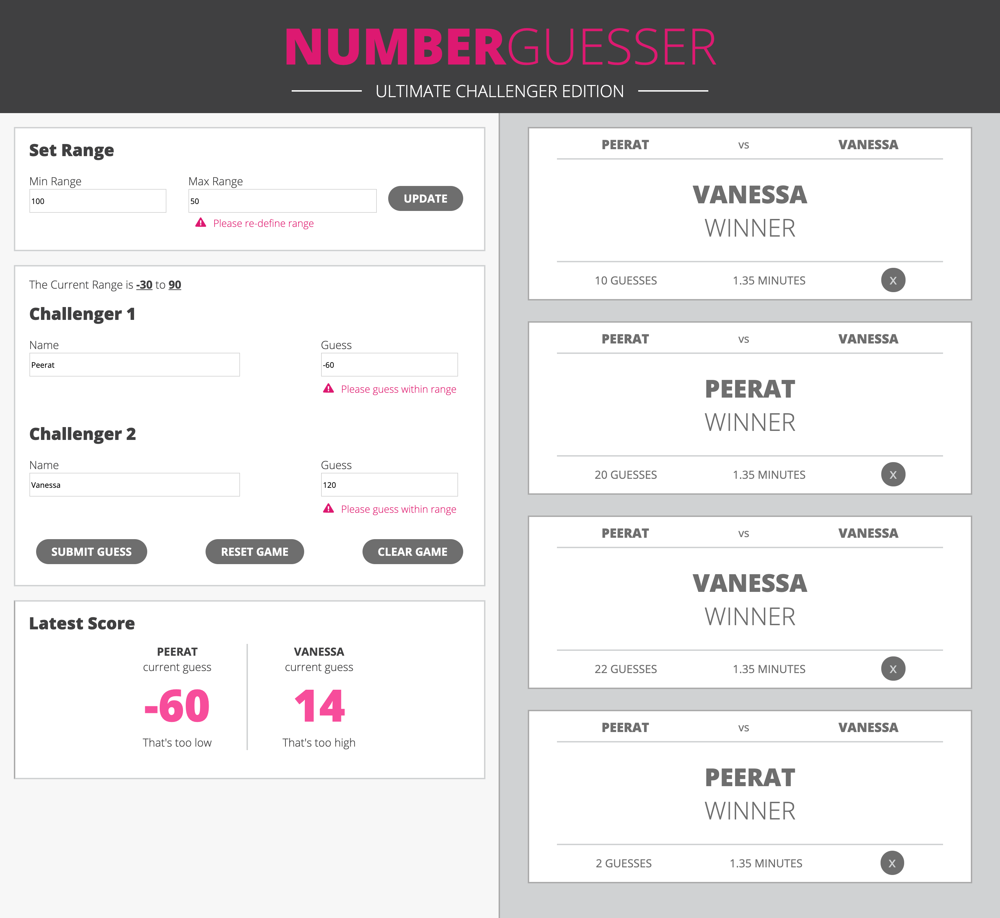
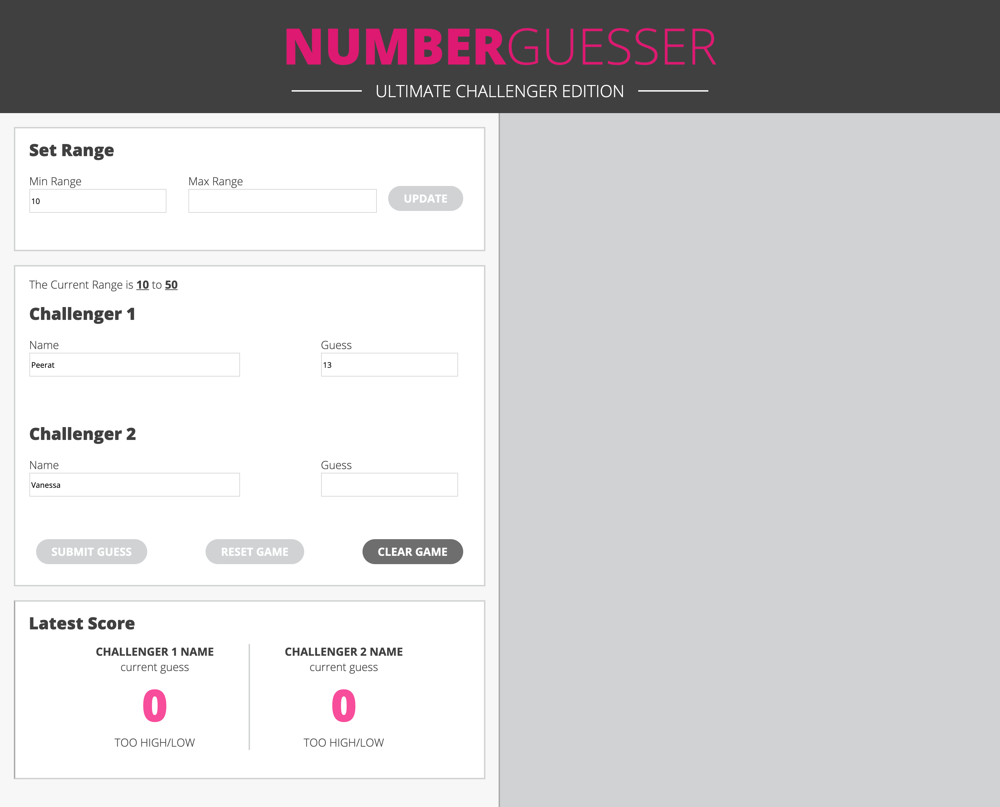
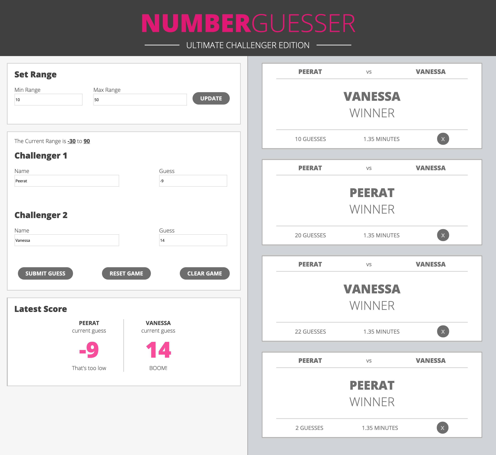
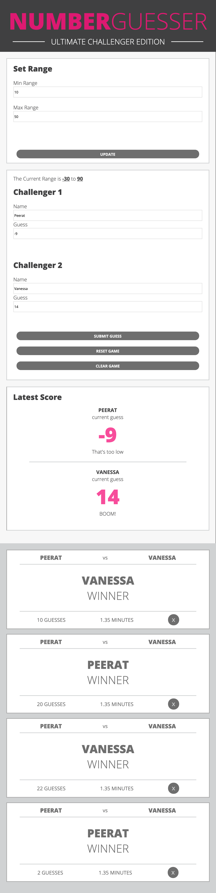
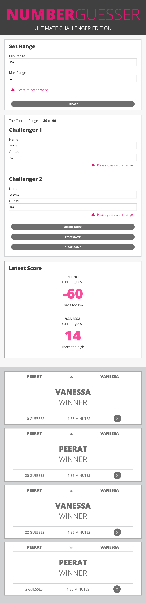

# Number Guesser Doubles (Pairing Project)
#### By [Peerat Sukcharoenyingyong](https://github.com/peeratmac) & [Vanessa Randall](https://github.com/vrandall66)

1. <a href="#1-learning-goals">Learning Goals</a>
2. <a href="#2-skills-acquired">Skills Acquired</a>
3. <a href="#3-technology">Technology</a>
4. <a href="#4-features">Features</a>
5. <a href="#5-screenshots">Screenshots</a>

## 1. Learning Goals

This was a partner project for Module 1 of the Front-End Engineering program at Turing School of Software and Design in Denver, CO. This was our first time pair-programming, and our first large-scale Vanilla JavaScript project that also allowed us to use FlexBox.

## 2. Skills Acquired

  - Semantic HTML
  - Clean and organized CSS
  - Practice writing DRY, organized JavaScript

## 3. Technology

  - HTML
  - CSS
  - JavaScript ES5

## 4. Features

  - Two players can set their preferred range to generate a random number
  - If inputs have no value, there is either an error message or the update/submit buttons are disabled
  - Players receive clues as to whether their guesses are too high or too low
  - Cards are generated upon victory to keep track of each round, and the number of guesses per round
  - Game is available on desktop, tablet, and mobile devices

## 5. Screenshots

### 5.1 Provided composition

### 5.2 Recreated composition

Desktop:

Mobile:

